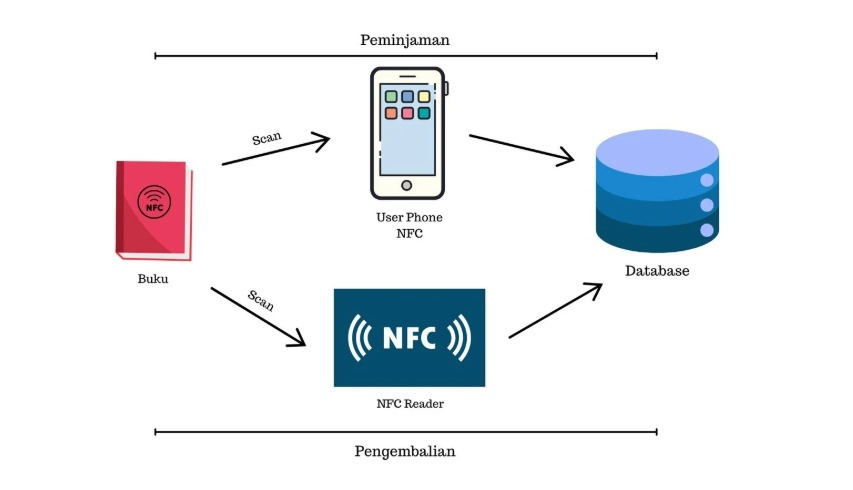

# 📚 GEBOOKS: Sistem Peminjaman Buku Pintar Berbasis NFC

GEBOOKS adalah sebuah prototipe sistem manajemen perpustakaan full-stack yang dirancang untuk memodernisasi proses peminjaman dan pengembalian buku menggunakan teknologi Near Field Communication (NFC). Proyek ini menggabungkan perangkat keras (IoT) dan aplikasi web untuk menciptakan pengalaman yang lebih efisien bagi pengguna dan pustakawan.
Sistem ini dikembangkan sebagai bagian dari Proyek Desain dan Aplikasi IoT, dengan fokus pada implementasi protokol HTTP untuk komunikasi antara perangkat dan server.

### 🖼️ Tampilan Aplikasi
**[Klik di sini untuk melihat semua screenshot tampilan GEBOOKS di Google Drive](https://drive.google.com/drive/folders/1pvhSlpxQ_-IrteSXNyGCjkabHqMq9nGj?usp=sharing)**

---

## 🏛️ Arsitektur Sistem

Sistem GEBOOKS menggunakan arsitektur Client-Server yang terdiri dari tiga komponen utama:
1.  **Aplikasi Web (Web App)**: Berfungsi sebagai antarmuka utama bagi pengguna. Dibangun menggunakan PHP native dan berjalan di local server (XAMPP).
2.  **Klien Peminjaman (User's Smartphone)**: Pengguna menggunakan fitur NFC pada ponsel mereka untuk memindai tag NFC pada buku, yang kemudian diarahkan ke aplikasi web untuk proses peminjaman. 
3.  **Klien Pengembalian (IoT Device)**: Sebuah perangkat yang terdiri dari **Arduino Uno** dan **NFC Reader PN532**. Perangkat ini didedikasikan untuk proses pengembalian buku. Ketika buku dipindai, perangkat mengirimkan data ke server untuk memperbarui status buku.
4.  **Database**: Menggunakan **MySQL** untuk menyimpan semua data terkait pengguna, katalog buku, dan riwayat transaksi peminjaman.

Berikut adalah Topologi jaringan untuk sistem GEBOOKS

---

## ✨ Fitur Utama

* **Manajemen Katalog Buku**: Operasi CRUD (Create, Read, Update, Delete) untuk data buku.
* **Manajemen Pengguna**: Sistem autentikasi dan pengelolaan data pengguna (admin dan peminjam).
* **Peminjaman Berbasis NFC**: Pengguna dapat meminjam buku hanya dengan melakukan *tap* ponsel mereka pada stiker NFC yang tertempel di buku.
* **Pengembalian Terpusat**: Proses pengembalian buku yang mudah menggunakan stasiun pembaca NFC khusus.
* **Riwayat Transaksi**: Mencatat semua aktivitas peminjaman dan pengembalian buku untuk setiap pengguna. 
* **Antarmuka Responsif**: Tampilan web yang dapat diakses dengan baik melalui perangkat mobile, dibangun menggunakan Bootstrap. 

---

## 🛠️ Teknologi yang Digunakan

| Kategori | Teknologi |
| :--- | :--- |
| **Backend** |  |
| **Database** |  |
| **Frontend** |    |
| **Hardware** |  |
| **Protokol** | `HTTP` |
| **Development Tools**| `XAMPP`, `Arduino IDE` |

---

## ⚙️ Kebutuhan Hardware

Untuk mereplikasi stasiun pengembalian buku (IoT Device), komponen berikut diperlukan:
* 1x **Arduino Uno** 
* 1x **NFC Reader PN532 ITEAD** 
* 1x **Stiker/Tag NFC** 
* Kabel Jumper secukupnya 

---

## 🚀 Cara Kerja Sistem

### Proses Peminjaman Buku
1.  Setiap buku ditempeli stiker NFC yang berisi URL unik ke halaman detail buku tersebut. 
2.  Pengguna mengaktifkan fitur NFC di ponselnya dan memindai stiker pada buku yang ingin dipinjam.
3.  Ponsel secara otomatis membuka browser dan mengarahkan ke halaman detail buku di website GEBOOKS. 
4.  Halaman ini menampilkan sinopsis, ketersediaan, dan tombol **"Pinjam"**.
5.  Saat tombol "Pinjam" ditekan, website mengirimkan request HTTP ke server. Server kemudian memperbarui status buku menjadi "dipinjam" dan mencatat transaksi tersebut di database. 

### Proses Pengembalian Buku
1.  Pengguna membawa buku ke stasiun pengembalian yang telah dilengkapi dengan Arduino dan NFC Reader PN532.
2.  Pengguna memindai stiker NFC buku ke alat pembaca. 
3.  Arduino membaca UID dari stiker NFC dan mengirimkan data UID tersebut ke server melalui request HTTP.
4.  Server menerima UID, mencari buku yang sesuai di database, dan mengubah statusnya dari "dipinjam" menjadi "tersedia". 
